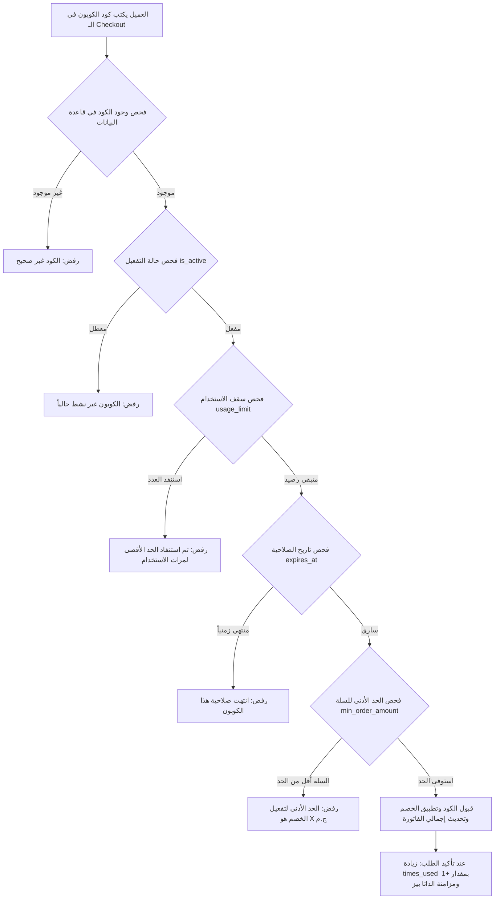

# Universal Promotional Coupon Engine (Module Specification)
## نظام إدارة كوبونات الخصم المتقدم للمتاجر الإلكترونية (توثيق هندسي قابل لإعادة الاستخدام)

---

### 1. نظرة عامة على النظام (System Overview)
هذا النظام مصمم ليكون **وحدة مستقلة (Standalone Module / Plug-and-Play Engine)** لإدارة كوبونات الخصم والعروض الترويجية في المتاجر الإلكترونية (Next.js / React / Node.js / PostgreSQL / Supabase).

يدعم النظام أربعة محاور رقابية رئيسية:
1. **نوع الخصم (Discount Type):** نسبة مئوية (`percentage`) أو مبلغ نقدي ثابت (`fixed_amount`).
2. **حد الشراء الأدنى (Minimum Order Amount):** حماية هوامش الربح باشتراط حد أدنى لقيمة السلة لتفعيل الكوبون.
3. **سقف الاستخدام بالعدد (Usage Quota Limit):** إيقاف الكوبون تلقائياً بعد تنفيذ عدد معين من الطلبات (مثلاً: أول 100 أوردر).
4. **سقف الصلاحية بالوقت (Time-based Expiration):** انتهاء الكوبون بمرور مدة زمنية محددة (يوم، شهر، أو تاريخ وساعة دقيقة).
5. **النمط الهجين (Hybrid Constraints):** دمج قيد الوقت وقيد العدد معاً (أيهما يكتمل أولاً يُلغى الكوبون تلقائياً).



---

### 2. مواصفات قاعدة البيانات وسكربت الـ SQL (Database DDL & Migration)

هذا الكود جاهز للتنفيذ المباشر داخل **SQL Editor** في **PostgreSQL** أو **Supabase**:

```sql
-- ==============================================================================
-- 1. تفعيل ملحق توليد المعرفات الفريدة UUID
-- ==============================================================================
CREATE EXTENSION IF NOT EXISTS "uuid-ossp";

-- ==============================================================================
-- 2. إنشاء جدول كوبونات الخصم (Coupons Table)
-- ==============================================================================
CREATE TABLE IF NOT EXISTS public.coupons (
    id UUID PRIMARY KEY DEFAULT uuid_generate_v4(),
    code VARCHAR(50) NOT NULL UNIQUE,
    discount_type VARCHAR(20) NOT NULL CHECK (discount_type IN ('percentage', 'fixed_amount')),
    discount_value DECIMAL(12, 2) NOT NULL CHECK (discount_value > 0),
    min_order_amount DECIMAL(12, 2) DEFAULT 0.00 CHECK (min_order_amount >= 0),
    usage_limit INT CHECK (usage_limit IS NULL OR usage_limit > 0),
    times_used INT NOT NULL DEFAULT 0 CHECK (times_used >= 0),
    expires_at TIMESTAMPTZ,
    is_active BOOLEAN NOT NULL DEFAULT true,
    created_at TIMESTAMPTZ NOT NULL DEFAULT NOW(),
    updated_at TIMESTAMPTZ NOT NULL DEFAULT NOW()
);

-- ==============================================================================
-- 3. الفهارس لتسريع البحث والتحقق الفوري (Indexes)
-- ==============================================================================
CREATE INDEX IF NOT EXISTS idx_coupons_code ON public.coupons(UPPER(code));
CREATE INDEX IF NOT EXISTS idx_coupons_active ON public.coupons(is_active);
CREATE INDEX IF NOT EXISTS idx_coupons_expiry ON public.coupons(expires_at);

-- ==============================================================================
-- 4. في حالة وجود الجدول مسبقاً: سكربت الترقية الآمن (Safe Alter Migrations)
-- ==============================================================================
DO $$ 
BEGIN 
    IF NOT EXISTS (SELECT 1 FROM information_schema.columns WHERE table_name='coupons' AND column_name='usage_limit') THEN
        ALTER TABLE public.coupons ADD COLUMN usage_limit INT;
    END IF;
    IF NOT EXISTS (SELECT 1 FROM information_schema.columns WHERE table_name='coupons' AND column_name='times_used') THEN
        ALTER TABLE public.coupons ADD COLUMN times_used INT NOT NULL DEFAULT 0;
    END IF;
    IF NOT EXISTS (SELECT 1 FROM information_schema.columns WHERE table_name='coupons' AND column_name='expires_at') THEN
        ALTER TABLE public.coupons ADD COLUMN expires_at TIMESTAMPTZ;
    END IF;
    IF NOT EXISTS (SELECT 1 FROM information_schema.columns WHERE table_name='coupons' AND column_name='min_order_amount') THEN
        ALTER TABLE public.coupons ADD COLUMN min_order_amount DECIMAL(12, 2) DEFAULT 0.00;
    END IF;
END $$;

-- ==============================================================================
-- 5. إعدادات وسياسات الأمان والحماية (Row Level Security - RLS)
-- ==============================================================================
ALTER TABLE public.coupons ENABLE ROW LEVEL SECURITY;

-- السماح للعملاء بالاستعلام عن الكوبونات للتحقق منها أثناء الدفع
DROP POLICY IF EXISTS "Allow public read active coupons" ON public.coupons;
CREATE POLICY "Allow public read active coupons" ON public.coupons
    FOR SELECT USING (is_active = true);

-- السماح لإدارة المتجر بالتحكم الكامل (إضافة / تعديل / حذف / تعطيل)
DROP POLICY IF EXISTS "Allow management on coupons" ON public.coupons;
CREATE POLICY "Allow management on coupons" ON public.coupons
    FOR ALL USING (true) WITH CHECK (true);
```

---

### 3. عقود البيانات البرمجية (TypeScript Interfaces)

ضع هذا الملف في مسار `src/types/coupons.ts` أو مسار الخدمات المشتركة:

```typescript
export type DiscountType = "percentage" | "fixed_amount";

export interface Coupon {
  id: string;
  code: string;
  discountType: DiscountType;
  discountValue: number;
  minOrderAmount: number;
  usageLimit?: number;        // سقف عدد الطلبات (مثلاً: 100)
  timesUsed: number;          // عدد الطلبات المنفذة حتى الآن
  expiresAt?: string;         // تاريخ وساعة الانتهاء بصيغة ISO
  isActive: boolean;          // تفعيل أو تعطيل الكوبون
  createdAt?: string;
}

export interface CouponValidationResult {
  valid: boolean;
  discountAmount: number;
  coupon?: Coupon;
  message: string;
}
```

---

### 4. خوارزمية التحقق الحسابية (Validation & Calculation Engine)

تمثل هذه الدالة عصب النظام (`validateCoupon`)، وتضمن تنفيذ كافة القواعد الرقابية بترتيب منطقي دقيق:

```typescript
export function validateCoupon(
  code: string,
  subtotal: number,
  couponsCatalog: Coupon[]
): CouponValidationResult {
  const cleanCode = code.trim().toUpperCase();
  const coupon = couponsCatalog.find((c) => c.code.toUpperCase() === cleanCode);

  // 1. التحقق من وجود الكوبون
  if (!coupon) {
    return {
      valid: false,
      discountAmount: 0,
      message: "كود الخصم غير موجود أو غير صحيح.",
    };
  }

  // 2. التحقق من حالة التفعيل
  if (!coupon.isActive) {
    return {
      valid: false,
      discountAmount: 0,
      message: "عذراً، هذا الكوبون متوقف حالياً.",
    };
  }

  // 3. التحقق من سقف عدد الاستخدامات (Usage Quota)
  if (coupon.usageLimit && coupon.usageLimit > 0 && coupon.timesUsed >= coupon.usageLimit) {
    return {
      valid: false,
      discountAmount: 0,
      message: `عذراً، استنفد هذا الكوبون الحد الأقصى لعدد الاستخدامات (${coupon.usageLimit} أوردر).`,
    };
  }

  // 4. التحقق من الصلاحية الزمنية وتاريخ الانتهاء (Time Expiration)
  if (coupon.expiresAt) {
    const expiryDate = new Date(coupon.expiresAt);
    if (!isNaN(expiryDate.getTime()) && expiryDate < new Date()) {
      return {
        valid: false,
        discountAmount: 0,
        message: `عذراً، انتهت صلاحية هذا الكوبون في ${expiryDate.toLocaleDateString("ar-EG")}.`,
      };
    }
  }

  // 5. التحقق من الحد الأدنى لقيمة المشتريات
  if (coupon.minOrderAmount && subtotal < coupon.minOrderAmount) {
    return {
      valid: false,
      discountAmount: 0,
      message: `الحد الأدنى لقيمة المشتريات لتفعيل هذا الكوبون هو ${coupon.minOrderAmount} ج.م (قيمة سلتك: ${subtotal} ج.م).`,
    };
  }

  // 6. الحساب الرياضي الدقيق لمبلغ الخصم
  let calculatedDiscount = 0;
  if (coupon.discountType === "percentage") {
    calculatedDiscount = Math.round((subtotal * coupon.discountValue) / 100);
  } else {
    calculatedDiscount = Math.min(subtotal, coupon.discountValue);
  }

  return {
    valid: true,
    discountAmount: calculatedDiscount,
    coupon,
    message:
      coupon.discountType === "percentage"
        ? `تم تطبيق خصم ${coupon.discountValue}% بقيمة ${calculatedDiscount} ج.م!`
        : `تم تطبيق خصم بقيمة ${calculatedDiscount} ج.م!`,
  };
}
```

---

### 5. دورة حياة تحديث الاستهلاك عند إتمام الطلب (Usage Consumption Lifecycle)

عند قيام العميل بالضغط على **"تأكيد الطلب"** بنجاح، يتم استدعاء دالة رفع عداد الاستخدام:

```typescript
export async function incrementCouponUsage(code: string, supabaseClient?: any): Promise<void> {
  const clean = code.trim().toUpperCase();
  
  // 1. التحديث المحلي (Local State / Storage)
  // ... زيادة times_used بمقدار 1، وإذا وصل إلى usageLimit يتم ضبط isActive = false تلقائياً.

  // 2. التحديث في قاعدة البيانات السحابية (PostgreSQL / Supabase RPC أو UPDATE)
  if (supabaseClient) {
    await supabaseClient.rpc("increment_coupon_times_used", { coupon_code: clean });
  }
}
```

دالة الـ SQL المقابلة للـ RPC لضمان معالجة التزامن العالي (Atomic Update):

```sql
CREATE OR REPLACE FUNCTION public.increment_coupon_times_used(coupon_code TEXT)
RETURNS VOID AS $$
BEGIN
    UPDATE public.coupons
    SET 
        times_used = times_used + 1,
        is_active = CASE 
            WHEN usage_limit IS NOT NULL AND (times_used + 1) >= usage_limit THEN false 
            ELSE is_active 
        END,
        updated_at = NOW()
    WHERE code = UPPER(coupon_code);
END;
$$ LANGUAGE plpgsql;
```

---

### 6. عناصر واجهة المستخدم القياسية (UI Components Blueprint)

عند بناء واجهة التحكم في أي مشروع، يجب توفير العناصر الآتية:

#### أ. نافذة الإضافة/التعديل (Admin Form):
* **كود الكوبون:** حقل نصوص بأحرف إنجليزية كبيرة مع زر توليد كود عشوائي تلقائي.
* **نوع الخصم:** زرين للاختيار السريع بين نسبة مئوية `%` أو مبلغ نقدي ثابت `ج.م`.
* **قيمة الخصم:** رقم الخصم المباشر.
* **الحد الأدنى لقيمة الطلب:** حقل رقمي (0 يعني يعمل بدون شرط).
* **سقف عدد الاستخدامات:** حقل رقمي مع أزرار سريعة جاهزة: `[50]` `[100]` `[200]` `[500]` `[غير محدود ∞]`.
* **مدة الصلاحية الزمنية:** حقل اختيار `datetime-local` مع أزرار سريعة جاهزة:
  * `يوم (24 ساعة)`
  * `3 أيام`
  * `أسبوع (7 أيام)`
  * `شهر (30 يوم)`
  * `دائم (بدون انتهاء) ∞`
* **معاينة مباشرة (Live Preview Card):** تعرض الجملة التسويقية التي ستظهر للعميل فورياً قبل الحفظ.

#### ب. جدول الإدارة (Admin Table):
* عمود **الاستهلاك:** شريط تقدم ملون (Progress Bar) يعرض النسبة المئوية للأوردرات المنفذة مقارنة بالسقف المتبقي.
* عمود **الصلاحية:** يعرض تاريخ الانتهاء وعدد الأيام المتبقية أو شارة `منتهي الصلاحية ⏰`.
* عمود **الحالة:** شارة خضراء `مفعل` أو شارة رمادية `معطل مؤقتاً` أو شارة حمراء `استنفد الحد / منتهي`.
* إجراءات بنقرة واحدة: زر **تفعيل/تعطيل سريع (Power Toggle)**، زر **تعديل**، وزر **حذف**.

---

### 7. خطوات الاستخدام في مشروع جديد (Quickstart Checklist)
1. تشغيل كود الـ SQL المذكور في **القسم 2** في قاعدة بيانات مشروعك الجديد.
2. نسخ ملف الخدمات `coupons-store.ts` ووضع مفاتيح الاتصال في `.env.local`.
3. استدعاء `validateCoupon()` داخل صفحة الـ `Checkout`.
4. استدعاء `incrementCouponUsage()` فور حفظ الطلب في قاعدة البيانات.
