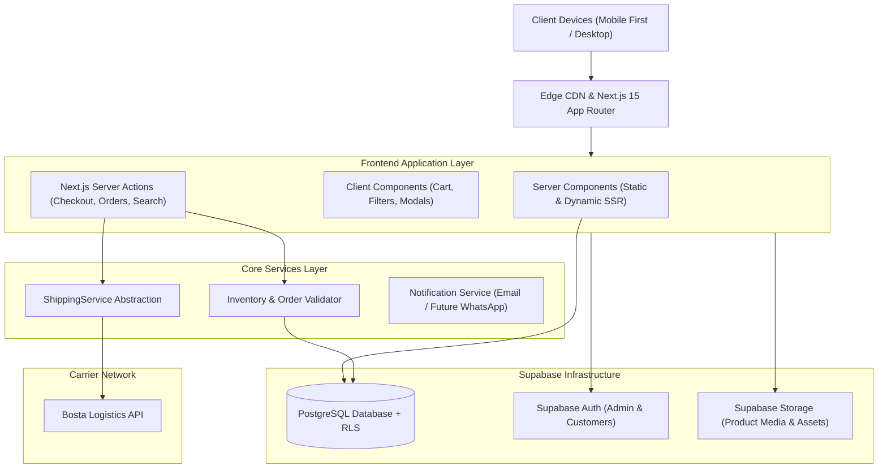
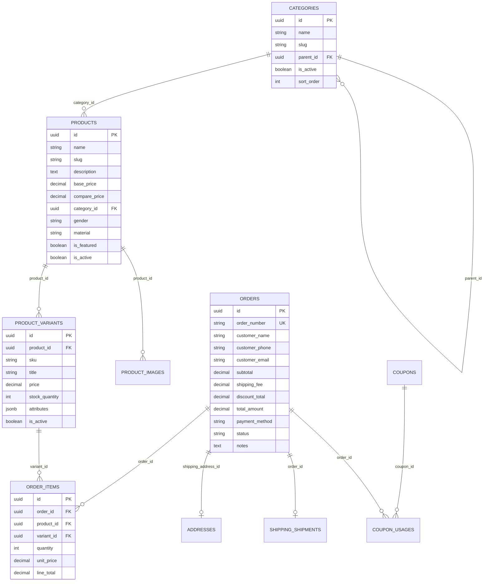
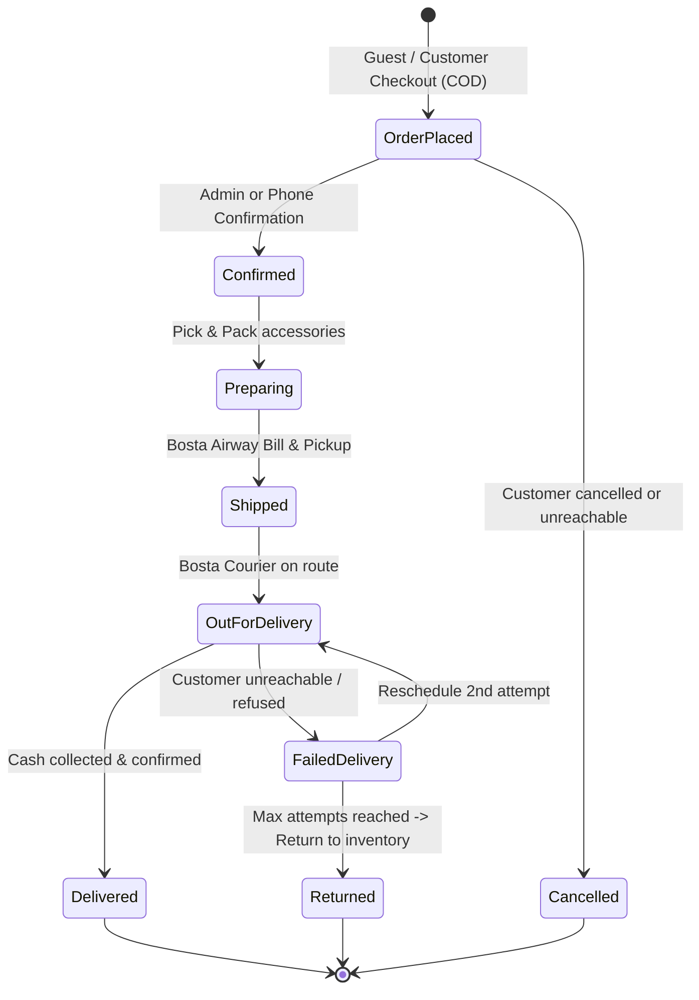
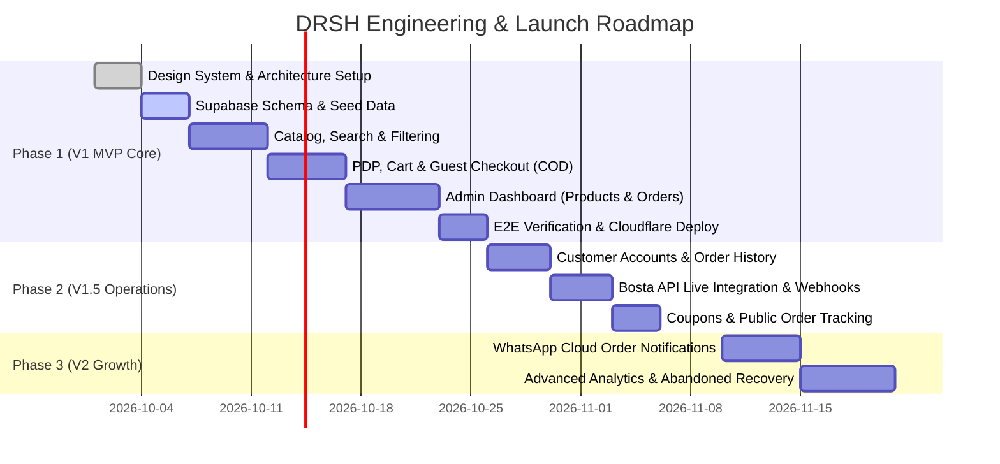

# DRSH (درش) — Product Requirements Document & Technical Specification

> **Brand Identity:** DRSH — MORE THAN JUST ACCESSORIES  
> **Market:** Egypt (B2C E-Commerce)  
> **Core Payment Model:** Cash on Delivery (COD)  
> **Fulfillment:** Bosta Delivery Network (via Abstracted Shipping Service)  
> **Version:** 1.0.0 (Production Specification)

---

## 1. Executive Summary & Brand Foundation

**DRSH** is a modern Egyptian lifestyle and accessories brand built on minimalism, accessible luxury, and high-perceived value. The digital flagship store must reflect this ethos through sleek aesthetics, instant load times, zero-friction mobile purchasing, and transparent fulfillment.

```
       ┌────────────────────────────────────────────────────────┐
       │                          DRSH                          │
       │              MORE THAN JUST ACCESSORIES                │
       └────────────────────────────────────────────────────────┘
                 │                                    │
       [ Aesthetic Core ]                   [ Commercial Engine ]
       • Modern Obsidian (#0B0B0B)          • Cash on Delivery (COD)
       • Champagne Beige (#D9C9B3)          • Frictionless Guest Checkout
       • Muted Slate (#686B6B)              • Real-time Inventory Safeguards
       • Off-White (#F5F5F3)                • Modular Shipping Abstraction
```

### 1.1 Core Value Proposition
- **Not a static catalog:** An end-to-end commerce system (`Discover → Search & Filter → Product Details & Variants → Bag → Frictionless Checkout → Instant Confirmation → Real-time Order Tracking`).
- **Target Audience:** Men, Women, and Unisex shoppers seeking timeless, refined everyday accessories (Watches, Bags, Jewelry, Eyewear, Leather goods, Perfumes, Gifts).
- **Payment Strategy:** 100% Cash on Delivery (COD) for launch, eliminating payment gateway drop-off and maximizing conversion in the Egyptian market.

---

## 2. System Architecture & Tech Stack



### 2.1 Technology Choices & Rationale
1. **Next.js 15+ (App Router + React 19 + TypeScript):**
   - **Server Components (RSC):** Fast initial load for product pages, dynamic OpenGraph metadata, and high-performance SEO.
   - **Server Actions:** Secure, direct database operations for checkout and order placement without exposing client-side API endpoints or prices.
2. **Tailwind CSS v4 / Tailwind v3 + shadcn/ui:**
   - Highly accessible, customizable UI primitives (Dialogs, Drawers, Sheets for mobile cart, Select, Toasts).
   - Strict design tokens aligned with DRSH color codes and typography.
3. **Framer Motion (Controlled & Subtle):**
   - Polished micro-interactions: Drawer slide-ins, layout transitions for filter tabs, subtle image hover zoom. No excessive or lagging animations.
4. **Backend: Supabase (PostgreSQL 16 + Auth + Storage + RLS):**
   - High-concurrency relational data modeling (variants, inventory locks, relational orders).
   - Row Level Security (RLS) guaranteeing data privacy between customer accounts and enforcing Super Admin permissions.
5. **Image Processing:**
   - Next.js Image Optimization (`next/image`) serving modern WebP/AVIF formats with responsive breakpoints.

---

## 3. Brand Identity & Design System Specification

### 3.1 Color Palette Tokens

| Token Name | Hex Code | RGB | Role / Usage |
| :--- | :--- | :--- | :--- |
| `--color-drsh-black` | `#0B0B0B` | `11, 11, 11` | Primary text, dark backgrounds, high-contrast CTA buttons, headers |
| `--color-drsh-beige` | `#D9C9B3` | `217, 201, 179` | Accent borders, badges, brand highlight, subtle hover overlays |
| `--color-drsh-gray` | `#686B6B` | `104, 107, 107` | Muted secondary text, metadata, form borders, breadcrumb links |
| `--color-drsh-offwhite` | `#F5F5F3` | `245, 245, 243` | Primary page canvas, card backgrounds, alternating table rows |
| `--color-drsh-white` | `#FFFFFF` | `255, 255, 255` | Card surfaces, inputs, modal dialogs |
| `--color-drsh-error` | `#B91C1C` | `185, 28, 28` | Stock alerts, form validation errors, cancellation badges |
| `--color-drsh-success`| `#15803D` | `21, 128, 61` | Delivered status, in-stock badges, order success banners |

### 3.2 Typography Hierarchy
- **Primary Latin Display & Body:** `Plus Jakarta Sans` or `Inter` (geometric, clean, modern luxury).
- **Secondary Arabic Typography:** `Cairo` or `IBM Plex Sans Arabic` (clear legibility, refined curves matching Latin geometric forms).
- **Monogram / Luxury Accent:** `Cinzel` or bespoke geometric SVG for headings and collection banners.

### 3.3 UI Elements & CTA Rules
- **Primary Buttons:** Solid `#0B0B0B` background, `#FFFFFF` text, subtle 2px border or clean radius (`rounded-sm` or `rounded-none` for architectural luxury), uppercase tracking (`tracking-wider`).
- **Secondary Buttons:** Transparent background with `#0B0B0B` border or `#D9C9B3` accent outline.
- **Card Aesthetics:** Minimalist thin border (`border border-neutral-200`), no heavy drop shadows, generous padding (`p-4` to `p-6`).

---

## 4. Comprehensive Database Schema (PostgreSQL / Supabase)



### 4.1 SQL Schema (DDL)

```sql
-- Enable UUID extension
CREATE EXTENSION IF NOT EXISTS "uuid-ossp";

-- 1. ENUMS
CREATE TYPE product_gender AS ENUM ('men', 'women', 'unisex');
CREATE TYPE order_status AS ENUM (
    'pending_confirmation',
    'confirmed',
    'preparing',
    'shipped',
    'out_for_delivery',
    'delivered',
    'cancelled',
    'returned',
    'failed_delivery'
);
CREATE TYPE payment_method_enum AS ENUM ('cod');
CREATE TYPE payment_status_enum AS ENUM ('unpaid', 'paid_on_delivery', 'refunded');

-- 2. CATEGORIES
CREATE TABLE public.categories (
    id UUID PRIMARY KEY DEFAULT uuid_generate_v4(),
    name VARCHAR(255) NOT NULL,
    slug VARCHAR(255) NOT NULL UNIQUE,
    description TEXT,
    image_url TEXT,
    parent_id UUID REFERENCES public.categories(id) ON DELETE SET NULL,
    is_active BOOLEAN NOT NULL DEFAULT true,
    sort_order INT NOT NULL DEFAULT 0,
    created_at TIMESTAMPTZ NOT NULL DEFAULT NOW(),
    updated_at TIMESTAMPTZ NOT NULL DEFAULT NOW()
);
CREATE INDEX idx_categories_slug ON public.categories(slug);
CREATE INDEX idx_categories_parent ON public.categories(parent_id);

-- 3. PRODUCTS
CREATE TABLE public.products (
    id UUID PRIMARY KEY DEFAULT uuid_generate_v4(),
    name VARCHAR(255) NOT NULL,
    slug VARCHAR(255) NOT NULL UNIQUE,
    description TEXT,
    details_html TEXT,
    category_id UUID NOT NULL REFERENCES public.categories(id) ON DELETE RESTRICT,
    brand VARCHAR(100) NOT NULL DEFAULT 'DRSH',
    material VARCHAR(100),
    gender product_gender NOT NULL DEFAULT 'unisex',
    base_price DECIMAL(12, 2) NOT NULL CHECK (base_price >= 0),
    compare_price DECIMAL(12, 2) CHECK (compare_price IS NULL OR compare_price > base_price),
    is_featured BOOLEAN NOT NULL DEFAULT false,
    is_new_arrival BOOLEAN NOT NULL DEFAULT true,
    is_active BOOLEAN NOT NULL DEFAULT true,
    created_at TIMESTAMPTZ NOT NULL DEFAULT NOW(),
    updated_at TIMESTAMPTZ NOT NULL DEFAULT NOW()
);
CREATE INDEX idx_products_slug ON public.products(slug);
CREATE INDEX idx_products_category ON public.products(category_id);
CREATE INDEX idx_products_gender ON public.products(gender);
CREATE INDEX idx_products_featured ON public.products(is_featured) WHERE is_featured = true;
CREATE INDEX idx_products_active ON public.products(is_active) WHERE is_active = true;

-- 4. PRODUCT VARIANTS
CREATE TABLE public.product_variants (
    id UUID PRIMARY KEY DEFAULT uuid_generate_v4(),
    product_id UUID NOT NULL REFERENCES public.products(id) ON DELETE CASCADE,
    sku VARCHAR(100) NOT NULL UNIQUE,
    title VARCHAR(255) NOT NULL,
    price DECIMAL(12, 2) NOT NULL CHECK (price >= 0),
    compare_price DECIMAL(12, 2),
    stock_quantity INT NOT NULL DEFAULT 0 CHECK (stock_quantity >= 0),
    attributes JSONB NOT NULL DEFAULT '{}'::jsonb,
    is_active BOOLEAN NOT NULL DEFAULT true,
    created_at TIMESTAMPTZ NOT NULL DEFAULT NOW(),
    updated_at TIMESTAMPTZ NOT NULL DEFAULT NOW()
);
CREATE INDEX idx_variants_product ON public.product_variants(product_id);
CREATE INDEX idx_variants_sku ON public.product_variants(sku);

-- 5. PRODUCT IMAGES
CREATE TABLE public.product_images (
    id UUID PRIMARY KEY DEFAULT uuid_generate_v4(),
    product_id UUID NOT NULL REFERENCES public.products(id) ON DELETE CASCADE,
    variant_id UUID REFERENCES public.product_variants(id) ON DELETE SET NULL,
    image_url TEXT NOT NULL,
    alt_text VARCHAR(255),
    sort_order INT NOT NULL DEFAULT 0,
    created_at TIMESTAMPTZ NOT NULL DEFAULT NOW()
);
CREATE INDEX idx_product_images_product ON public.product_images(product_id);

-- 6. ADDRESSES
CREATE TABLE public.addresses (
    id UUID PRIMARY KEY DEFAULT uuid_generate_v4(),
    user_id UUID REFERENCES auth.users(id) ON DELETE SET NULL,
    full_name VARCHAR(255) NOT NULL,
    phone_number VARCHAR(30) NOT NULL,
    governorate VARCHAR(100) NOT NULL,
    city VARCHAR(100) NOT NULL,
    street_address TEXT NOT NULL,
    building_no VARCHAR(50),
    floor_no VARCHAR(50),
    apartment_no VARCHAR(50),
    landmark TEXT,
    created_at TIMESTAMPTZ NOT NULL DEFAULT NOW()
);

-- 7. ORDERS
CREATE TABLE public.orders (
    id UUID PRIMARY KEY DEFAULT uuid_generate_v4(),
    order_number VARCHAR(50) NOT NULL UNIQUE,
    user_id UUID REFERENCES auth.users(id) ON DELETE SET NULL,
    customer_name VARCHAR(255) NOT NULL,
    customer_phone VARCHAR(30) NOT NULL,
    customer_email VARCHAR(255),
    shipping_address_id UUID NOT NULL REFERENCES public.addresses(id) ON DELETE RESTRICT,
    
    subtotal DECIMAL(12, 2) NOT NULL CHECK (subtotal >= 0),
    shipping_fee DECIMAL(12, 2) NOT NULL DEFAULT 0.00 CHECK (shipping_fee >= 0),
    discount_amount DECIMAL(12, 2) NOT NULL DEFAULT 0.00 CHECK (discount_amount >= 0),
    total_amount DECIMAL(12, 2) NOT NULL CHECK (total_amount >= 0),
    
    payment_method payment_method_enum NOT NULL DEFAULT 'cod',
    payment_status payment_status_enum NOT NULL DEFAULT 'unpaid',
    status order_status NOT NULL DEFAULT 'pending_confirmation',
    
    customer_notes TEXT,
    admin_notes TEXT,
    created_at TIMESTAMPTZ NOT NULL DEFAULT NOW(),
    updated_at TIMESTAMPTZ NOT NULL DEFAULT NOW()
);
CREATE INDEX idx_orders_number ON public.orders(order_number);
CREATE INDEX idx_orders_phone ON public.orders(customer_phone);
CREATE INDEX idx_orders_status ON public.orders(status);
CREATE INDEX idx_orders_user ON public.orders(user_id);

-- 8. ORDER ITEMS
CREATE TABLE public.order_items (
    id UUID PRIMARY KEY DEFAULT uuid_generate_v4(),
    order_id UUID NOT NULL REFERENCES public.orders(id) ON DELETE CASCADE,
    product_id UUID NOT NULL REFERENCES public.products(id) ON DELETE RESTRICT,
    variant_id UUID NOT NULL REFERENCES public.product_variants(id) ON DELETE RESTRICT,
    product_name VARCHAR(255) NOT NULL,
    variant_title VARCHAR(255) NOT NULL,
    sku VARCHAR(100) NOT NULL,
    quantity INT NOT NULL CHECK (quantity > 0),
    unit_price DECIMAL(12, 2) NOT NULL CHECK (unit_price >= 0),
    line_total DECIMAL(12, 2) NOT NULL CHECK (line_total >= 0)
);
CREATE INDEX idx_order_items_order ON public.order_items(order_id);

-- 9. SHIPPING SHIPMENTS (BOSTA ABSTRACTION)
CREATE TABLE public.shipping_shipments (
    id UUID PRIMARY KEY DEFAULT uuid_generate_v4(),
    order_id UUID NOT NULL UNIQUE REFERENCES public.orders(id) ON DELETE CASCADE,
    carrier VARCHAR(50) NOT NULL DEFAULT 'bosta',
    shipment_external_id VARCHAR(100),
    tracking_number VARCHAR(100),
    tracking_url TEXT,
    status VARCHAR(50) NOT NULL DEFAULT 'created',
    carrier_response JSONB,
    created_at TIMESTAMPTZ NOT NULL DEFAULT NOW(),
    updated_at TIMESTAMPTZ NOT NULL DEFAULT NOW()
);

-- 10. COUPONS
CREATE TABLE public.coupons (
    id UUID PRIMARY KEY DEFAULT uuid_generate_v4(),
    code VARCHAR(50) NOT NULL UNIQUE,
    discount_type VARCHAR(20) NOT NULL CHECK (discount_type IN ('percentage', 'fixed_amount')),
    discount_value DECIMAL(12, 2) NOT NULL CHECK (discount_value > 0),
    min_order_amount DECIMAL(12, 2) DEFAULT 0.00,
    usage_limit INT,
    times_used INT NOT NULL DEFAULT 0,
    expires_at TIMESTAMPTZ,
    is_active BOOLEAN NOT NULL DEFAULT true,
    created_at TIMESTAMPTZ NOT NULL DEFAULT NOW()
);

CREATE TABLE public.coupon_usages (
    id UUID PRIMARY KEY DEFAULT uuid_generate_v4(),
    coupon_id UUID NOT NULL REFERENCES public.coupons(id) ON DELETE CASCADE,
    order_id UUID NOT NULL REFERENCES public.orders(id) ON DELETE CASCADE,
    discount_applied DECIMAL(12, 2) NOT NULL,
    created_at TIMESTAMPTZ NOT NULL DEFAULT NOW()
);

-- 11. HOMEPAGE CMS & SITE SETTINGS
CREATE TABLE public.homepage_sections (
    id UUID PRIMARY KEY DEFAULT uuid_generate_v4(),
    section_key VARCHAR(100) NOT NULL UNIQUE,
    title VARCHAR(255),
    subtitle TEXT,
    payload JSONB NOT NULL DEFAULT '{}'::jsonb,
    is_active BOOLEAN NOT NULL DEFAULT true,
    sort_order INT NOT NULL DEFAULT 0,
    updated_at TIMESTAMPTZ NOT NULL DEFAULT NOW()
);
```

### 4.2 Row Level Security (RLS) Policies
- **`products` & `categories` & `product_variants` & `product_images`:**
  - `SELECT`: `true` for all where `is_active = true`.
  - `INSERT/UPDATE/DELETE`: Super Admin / Admin service role only.
- **`orders` & `order_items` & `addresses`:**
  - `SELECT`: Customers can only read where `user_id = auth.uid()`. Unauthenticated users can access order status ONLY via a secure lookup endpoint validating `(order_number, customer_phone)` match.
  - `INSERT`: Anyone can insert (via server-side verified Server Actions).
  - `UPDATE/DELETE`: Restricted to authenticated Admin service role.

---

## 5. Fulfillment & Shipping Abstraction (Bosta Specification)

```typescript
export interface ShippingRateRequest {
  governorate: string;
  city?: string;
  totalWeightGrams?: number;
  codAmount: number;
}

export interface ShippingRateResult {
  carrier: string;
  shippingFee: number;
  estimatedDays: string;
}

export interface CreateShipmentPayload {
  orderNumber: string;
  receiver: {
    name: string;
    phone: string;
    secondaryPhone?: string;
    email?: string;
  };
  dropOffAddress: {
    governorate: string;
    city: string;
    street: string;
    building?: string;
    floor?: string;
    apartment?: string;
    notes?: string;
  };
  codAmount: number;
  itemsCount: number;
  description: string;
}

export interface ShipmentResponse {
  carrier: 'bosta' | 'custom';
  shipmentId: string;
  trackingNumber: string;
  trackingUrl: string;
  status: string;
}

export interface IShippingProvider {
  name: string;
  calculateRate(request: ShippingRateRequest): Promise<ShippingRateResult>;
  createShipment(payload: CreateShipmentPayload): Promise<ShipmentResponse>;
  trackShipment(trackingNumber: string): Promise<any>;
  cancelShipment(shipmentId: string): Promise<boolean>;
}
```

### 5.1 Egyptian Shipping Rates & Zones (Baseline)

| Zone | Governorates Included | Baseline COD Fee (EGP) | Delivery SLA |
| :--- | :--- | :--- | :--- |
| **Zone 1 (Greater Cairo)** | Cairo, Giza, Qalyubia | 55 - 65 EGP | 24 - 48 Hours |
| **Zone 2 (Alexandria & Delta)** | Alexandria, Kafr El Sheikh, Gharbia, Dakahlia, Sharkia, Menofia, Beheira, Damietta | 65 - 75 EGP | 2 - 3 Days |
| **Zone 3 (Canal & Upper Egypt)** | Ismailia, Port Said, Suez, Beni Suef, Faiyum, Minya, Asyut, Sohag, Qena, Luxor, Aswan | 80 - 95 EGP | 3 - 5 Days |
| **Zone 4 (Remote / Red Sea)** | Red Sea (Hurghada), Matrouh, South Sinai, North Sinai, New Valley | 100 - 130 EGP | 4 - 6 Days |

---

## 6. End-to-End Order & COD State Machine



### 6.1 Server-Side Order Security Verification Flow
1. **Zero Client Trust:** Frontend sends only `[{ variantId, quantity }]` + Customer Address Info. Prices sent by the browser are completely ignored.
2. **Atomic Verification:** Server Action fetches live variant prices, verifies active flags, and checks `stock_quantity >= quantity`.
3. **Transaction Locking:** Uses PostgreSQL row-level lock (`SELECT ... FOR UPDATE`) to prevent race conditions during high-volume flash drops.
4. **Order Number Generation:** Sequential format with human-friendly prefix (`DRSH-10001`, `DRSH-10002`).
5. **Stock Decrement:** Decrements variant stock immediately upon confirmed checkout. If an order is cancelled or returned, inventory is automatically restored.

---

## 7. User Experience & Page Specifications

### 7.1 Global Header
- **Desktop Layout:**
  - Left: Minimal brand logo mark (`D` monogram + `DRSH`).
  - Center: Main navigation links: `Shop`, `Men`, `Women`, `Unisex`, `New Arrivals`, `Best Sellers`.
  - Right: Search trigger (quick modal/bar), Wishlist icon with count badge, Bag / Cart icon with dynamic count badge, Account icon.
- **Mobile Navigation:**
  - Sticky clean top bar: `[ Hamburger Menu ]` `[ DRSH Center Logo ]` `[ Search Icon ]` `[ Bag Icon ]`.
  - Bottom App-like navigation bar for quick access: `Home`, `Categories`, `Search`, `Bag`.

### 7.2 Search & Instant Suggestions UX
- Dynamic real-time search with debouncing (300ms).
- Categorized suggestion drawer:
  - Matching Products (with thumbnail, title, price).
  - Matching Categories (e.g. "Watches", "Leather Bags").
  - Quick tags (e.g. "Minimal Black Watch", "Silver Ring", "For Him").
- Dedicated `/search?q=query` page with comprehensive filters.

### 7.3 Product Listing Page (PLP) & Filtering
- Multi-faceted filters:
  - **Category** (Watches, Bags, Jewelry & Rings, Eyewear, Perfumes, Gifts).
  - **Gender** (`Men`, `Women`, `Unisex`).
  - **Price Range Slider** (`EGP 0` to `EGP 5,000+`).
  - **Color Swatches** (`Black`, `Silver`, `Gold`, `Beige`, `Brown`).
  - **Material** (`Stainless Steel`, `Genuine Leather`, `Titanium`, `Fabric`).
  - **Availability** (`In Stock` only toggle).
- Sorting options: `Featured`, `Newest`, `Price: Low to High`, `Price: High to Low`.

### 7.4 Product Details Page (PDP)
- **Visuals:** Gallery layout with thumbnail selector, full-screen zoom, and lifestyle product photos.
- **Variant Selector:** Interactive color chips and size buttons that dynamically update SKU, live stock status, and pricing.
- **Stock Transparency:**
  - If `stock > 5`: Displays `✓ In Stock`.
  - If `1 <= stock <= 5`: Displays `⚠ Only X left in stock` (strictly tied to actual database stock, zero false urgency).
  - If `stock == 0`: Displays `Out of Stock` and disables checkout buttons.
- **COD Trust Banner:**
  - "Cash on Delivery across all Egypt governorates."
  - "Inspect your items upon arrival before payment."

### 7.5 Frictionless Guest Checkout (COD Only)
- Single-page streamlined checkout with zero mandatory password creation:
  - **Step 1: Contact Details:** Full Name, Primary Phone Number (required for Bosta delivery courier), Optional Email.
  - **Step 2: Egyptian Address Matrix:**
    - Governorate dropdown (triggers dynamic shipping calculation).
    - City / Area input.
    - Street Address, Building Number, Floor, Apartment, and Landmark.
  - **Step 3: Payment Confirmation:**
    - Cash on Delivery preselected as the exclusive payment method.
    - Transparent breakdown: `Subtotal + Shipping Fee - Coupon Discount = Total Due on Delivery`.
  - **Step 4: CTA:** Large, unmissable `CONFIRM ORDER (CASH ON DELIVERY)` button.

### 7.6 Order Confirmation & Tracking
- **Confirmation Page (`/order/confirmed/[orderNumber]`):**
  - Instant order summary with unique order ID (e.g. `DRSH-10452`).
  - Summary of items, expected delivery timeframe, and instructions for courier arrival.
- **Self-Service Order Tracker (`/track-order`):**
  - Requires `Order Number` + `Phone Number`.
  - Displays progressive status stepper (`Order Placed → Confirmed → Preparing → Shipped → Out for Delivery → Delivered`) and Bosta tracking link when available.

---

## 8. Admin Control Center (`/admin`)

| Module | Core Functional Capabilities |
| :--- | :--- |
| **Executive Dashboard** | Real-time KPIs: Today's Orders, Total Revenue, Pending Confirmation queue, Out-of-Stock alerts, Top Search Queries. |
| **Product Management** | Create, edit, duplicate, and archive products. Rich variant generator (colors, sizes, individual SKUs, stock levels, compare prices). |
| **Media Library** | Upload and assign product images directly to Supabase Storage with drag-and-drop sort order. |
| **Order Management** | Comprehensive order table with quick filters (`Pending`, `Confirmed`, `Shipped`, `Delivered`). Detailed view with one-click status transitions. |
| **Fulfillment Actions** | Generate Bosta Waybill, trigger shipment creation via `ShippingService`, print packing slips. |
| **Inventory Matrix** | Global stock monitor, quick in-line stock quantity adjustments, low-stock notifications. |
| **Coupon Manager** | Fixed amount / percentage discounts, minimum cart spend, single-use limits, expiry dates. |
| **Homepage CMS** | Reorder homepage sections, change hero banner images, assign featured collections without code deploys. |

---

## 9. Phased Implementation Roadmap



### Phase 1: V1 MVP (Go-Live Target)
- Modern Responsive Storefront (Mobile-first).
- Full Product Catalog with Variants, Categories, and Multi-faceted Filters.
- Real-time Client & Server Search.
- Cart Drawer & Dedicated Cart Page.
- Guest Checkout with Egyptian Address Validation & COD Order Placement.
- Order Confirmation & Secure Order Details.
- Admin Panel: Product CRUD, Variant Manager, Order Pipeline, Inventory Monitor.
- SEO Architecture (Dynamic Metadata, JSON-LD Schema).

### Phase 2: V1.5 (Enhanced Operations)
- Customer Authentication (Supabase Auth: Magic Link / Email & Password).
- Customer Account Portal: Order History, Saved Addresses, Wishlist.
- Automated Bosta API webhook sync for real-time tracking updates.
- Promotional Coupon engine.
- Verified customer reviews & rating system.

### Phase 3: V2 (Scale & Automation)
- Automated WhatsApp notifications on status changes (`Order Confirmed`, `Shipped`).
- Dynamic abandoned checkout reminders.
- Loyalty & customer VIP tiers.
- Multi-carrier logistics routing if secondary couriers are introduced.

---

## 10. Security, Performance & Scalability Standards

1. **Anti-Tampering Pricing:**
   - Client sends product variant IDs and quantities. The server computes line items and order totals directly from the database within an isolated Server Action.
2. **Anti-Abuse & Rate Limiting:**
   - Rate limiting on Checkout and Search Server Actions (e.g. max 5 order submissions per IP per 10 minutes to protect against spam orders).
3. **Database Indexing:**
   - B-Tree indexes on `slug`, `sku`, `status`, `created_at`, and `category_id`.
   - Full-text search using PostgreSQL `to_tsvector` or pg_trgm extension for fast Arabic and English keyword queries.
4. **Image Delivery:**
   - All product imagery hosted on Supabase Storage / Cloudflare Images with responsive `srcset` and caching headers (`Cache-Control: public, max-age=31536000, immutable`).
